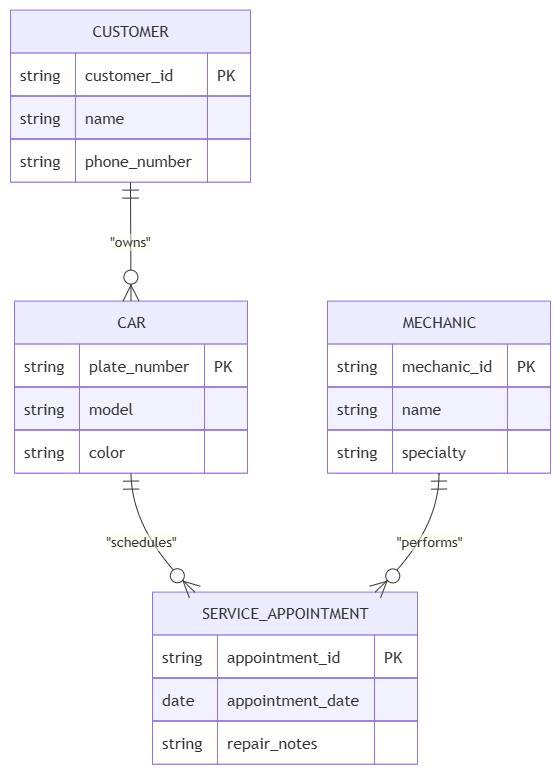

# INFOMAN1 – Week 2 Lab: Conceptual ERD Case Study

**Name:** Eli Felize Herreria  
**Student ID:** [Your Student ID]  
**Section:** [Your Section]  

## Task 1 — Candidate Entities

| Entity | Justification |
|---|---|
| **Customer** | The scenario mentions "each customer may bring in one or more cars," making Customer an independent entity with descriptive attributes. |
| **Car** | Cars have unique attributes (plate number, model, color) and are the main objects receiving repairs. |
| **Mechanic** | Mechanics have distinct attributes (name, specialty) and perform service work. |
| **Service Appointment** | Captures specific repair events connecting mechanics and cars, storing event attributes like date and repair notes. |

## Task 2 — Attributes per Entity

### Customer
- **Primary Key:** `customer_id`
- **Attributes:**
  - `customer_id` — Domain: numeric / integer (auto-generated)
  - `name` — Domain: text / string
  - `phone_number` — Domain: text / string

### Car
- **Primary Key:** `plate_number`
- **Attributes:**
  - `plate_number` — Domain: text / alphanumeric
  - `model` — Domain: text
  - `color` — Domain: text

### Mechanic
- **Primary Key:** `mechanic_id`
- **Attributes:**
  - `mechanic_id` — Domain: numeric / integer
  - `name` — Domain: text
  - `specialty` — Domain: text

### Service Appointment
- **Primary Key:** `appointment_id`
- **Attributes:**
  - `appointment_id` — Domain: numeric / integer
  - `appointment_date` — Domain: date / timestamp
  - `repair_notes` — Domain: text

## Task 3 — Relationships

| Relationship (verb phrase) | Between | Cardinality | Checked both directions? |
|---|---|---|---|
| **owns** | Customer ↔ Car | **1:N** | Yes — One customer can own multiple cars, but each car belongs to exactly one customer. |
| **services** | Mechanic ↔ Car | **M:N** | Yes — One mechanic can work on many cars over time, and one car can be serviced by different mechanics on different visits. |

*(Note: The `Service Appointment` entity acts as the associative entity resolving the M:N relationship).*

## Task 4 — Conceptual ERD

